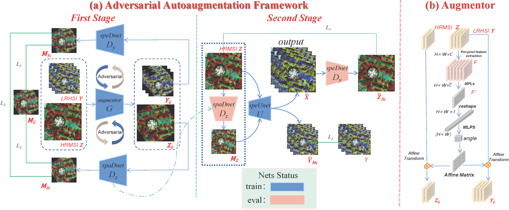

# ADASR: An Adversarial Auto-Augmentation Framework for Hyperspectral and Multispectral Data Fusion
This repo is the official implementation of "ADASR: An Adversarial Auto-Augmentation Framework for Hyperspectral and Multispectral Data Fusion"

Our paper is accpeted by IEEE Geoscience and Remote Sensing Letters (GRSL).

The early access version can be downloaded in [arxiv](https://arxiv.org/pdf/2310.07255.pdf).

Other description will be released soon.